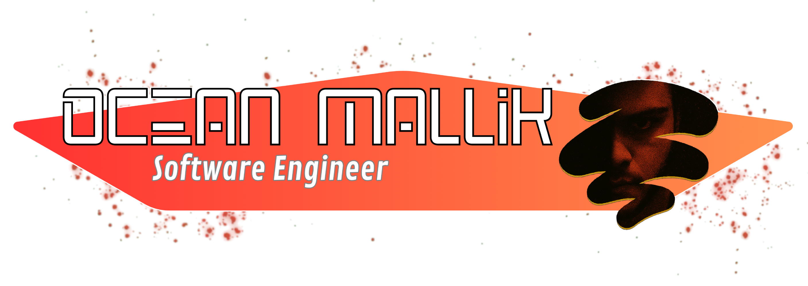
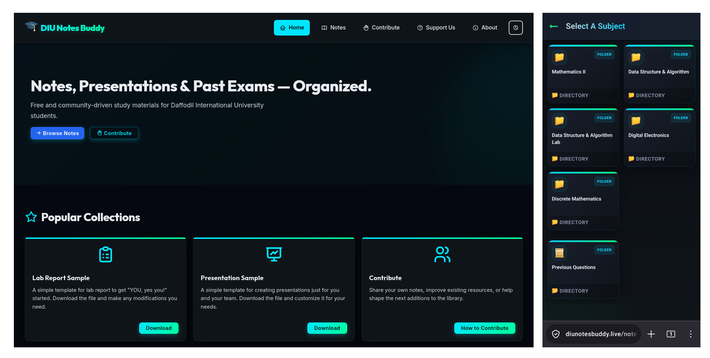

	

### Software engineering student building reliable, efficient software with a focus on clean implementation and practical problem solving.

[![LinkedIn](https://img.shields.io/badge/Linkedin-%40oceanmallik-black?style=for-the-badge&logo=data:image/svg%2bxml;base64,PHN2ZyB4bWxucz0iaHR0cDovL3d3dy53My5vcmcvMjAwMC9zdmciIHNoYXBlLXJlbmRlcmluZz0iZ2VvbWV0cmljUHJlY2lzaW9uIiB0ZXh0LXJlbmRlcmluZz0iZ2VvbWV0cmljUHJlY2lzaW9uIiBpbWFnZS1yZW5kZXJpbmc9Im9wdGltaXplUXVhbGl0eSIgZmlsbC1ydWxlPSJldmVub2RkIiBjbGlwLXJ1bGU9ImV2ZW5vZGQiIHZpZXdCb3g9IjAgMCA1MTIgNTA5LjY0Ij48cmVjdCB3aWR0aD0iNTEyIiBoZWlnaHQ9IjUwOS42NCIgcng9IjExNS42MSIgcnk9IjExNS42MSIvPjxwYXRoIGZpbGw9IiNmZmYiIGQ9Ik0yMDQuOTcgMTk3LjU0aDY0LjY5djMzLjE2aC45NGM5LjAxLTE2LjE2IDMxLjA0LTMzLjE2IDYzLjg5LTMzLjE2IDY4LjMxIDAgODAuOTQgNDIuNTEgODAuOTQgOTcuODF2MTE2LjkyaC02Ny40NmwtLjAxLTEwNC4xM2MwLTIzLjgxLS40OS01NC40NS0zNS4wOC01NC40NS0zNS4xMiAwLTQwLjUxIDI1LjkxLTQwLjUxIDUyLjcydjEwNS44NmgtNjcuNFYxOTcuNTR6bS0zOC4yMy02NS4wOWMwIDE5LjM2LTE1LjcyIDM1LjA4LTM1LjA4IDM1LjA4LTE5LjM3IDAtMzUuMDktMTUuNzItMzUuMDktMzUuMDggMC0xOS4zNyAxNS43Mi0zNS4wOCAzNS4wOS0zNS4wOCAxOS4zNiAwIDM1LjA4IDE1LjcxIDM1LjA4IDM1LjA4em0tNzAuMTcgNjUuMDloNzAuMTd2MjE0LjczSDk2LjU3VjE5Ny41NHoiLz48L3N2Zz4=&labelColor=red)](https://www.linkedin.com/in/oceanmallik/) 

##  What I Work On

- Strong foundations in programming and software engineering
- Building projects that are simple to understand and dependable to run
- Learning by solving real problems and refining the result

##  GitHub Snapshot

<table align="center">
	<tr>
		<td></td>
  		<td></td>
  		<td></td>
	</tr>
</table>

 

#  Works That I've Worked on

## 1. DIU Notes Buddy

DIU Notes Buddy is a free, open-source note-sharing platform built for students of the Software Engineering Department at Daffodil International University (DIU). No sign-ups, no paywalls — just organized, accessible study materials for everyone.

    

 

	

## 2. My Main Portfolio Website

This is the source for oceanmallik.com — a small, multi-page personal portfolio built with plain HTML, modern CSS, and vanilla JavaScript. The site is served as static assets with no build step or external dependencies, so it can be deployed directly to any static hosting provider.

   

 

	

