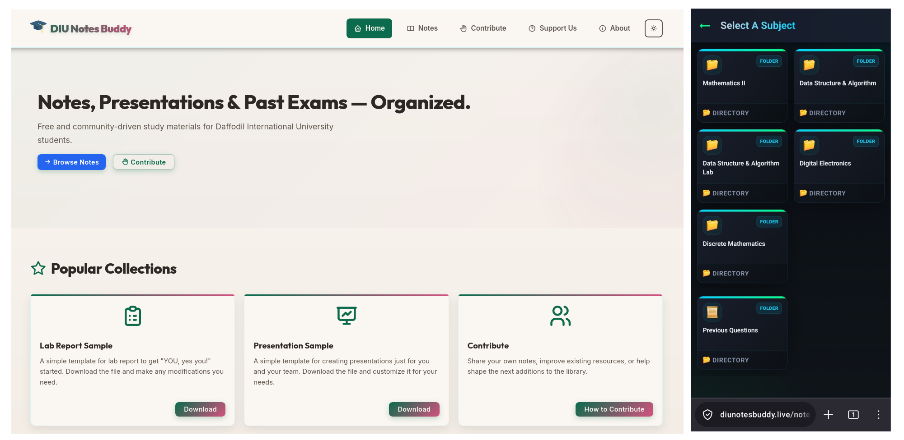

# Ocean Mallik

Software engineering student building reliable, efficient software with a focus on clean implementation and practical problem solving.

[LinkedIn](https://www.linkedin.com/in/oceanmallik) • [GitHub](https://github.com/oceanmallik)

 

## What I Work On

- Strong foundations in programming and software engineering
- Building projects that are simple to understand and dependable to run
- Learning by solving real problems and refining the result

## Tech Stack

## GitHub Snapshot

<table align="center">
	<tr>
		<td></td>
        <td></td>
		<td></td>
	</tr>
</table>

 

# Featured Work

## 1. DIU Notes Buddy

DIU Notes Buddy is a free, open-source note-sharing platform built for students of the Software Engineering Department at Daffodil International University (DIU). No sign-ups, no paywalls — just organized, accessible study materials for everyone.

<table align="center">
	<tr>
		<td>
			<picture>
				<source media="(prefers-color-scheme: dark)" srcset="./project-assets/DIUNotesBuddy/DNB-Dark.png" />
				
			</picture>
		</td>
	</tr>
</table>

