# Hi there, I'm **Ocean Mallik** 👋

I'm a student of Software Engineering who is passionate about building reliable and efficient software. 

## 💻 Tech Stack:
    

## 🛠 About Me

* 🔭 I’m currently on **Daffodil International University**
* 📫 How to reach me: **[LinkedIn](https://www.linkedin.com/in/oceanmallik)**

## 📊 GitHub Stats:
  

<!-- Credit: Proudly created with GPRM ( https://gprm.itsvg.in ) -->
 
