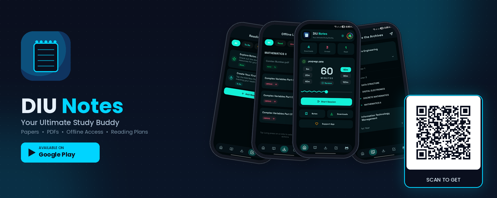
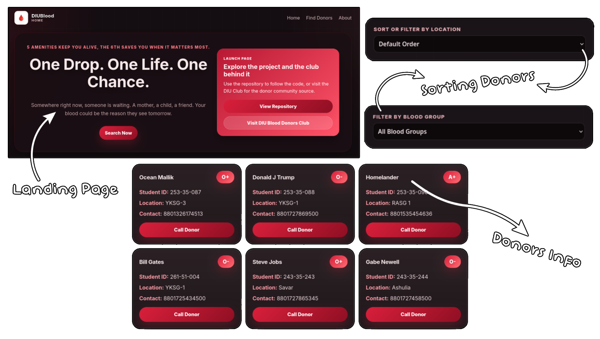

	

### Software engineering student building reliable and efficient software.

[![LinkedIn](https://img.shields.io/badge/Linkedin-%40oceanmallik-black?style=for-the-badge&logo=data:image/svg%2bxml;base64,PHN2ZyB4bWxucz0iaHR0cDovL3d3dy53My5vcmcvMjAwMC9zdmciIHNoYXBlLXJlbmRlcmluZz0iZ2VvbWV0cmljUHJlY2lzaW9uIiB0ZXh0LXJlbmRlcmluZz0iZ2VvbWV0cmljUHJlY2lzaW9uIiBpbWFnZS1yZW5kZXJpbmc9Im9wdGltaXplUXVhbGl0eSIgZmlsbC1ydWxlPSJldmVub2RkIiBjbGlwLXJ1bGU9ImV2ZW5vZGQiIHZpZXdCb3g9IjAgMCA1MTIgNTA5LjY0Ij48cmVjdCB3aWR0aD0iNTEyIiBoZWlnaHQ9IjUwOS42NCIgcng9IjExNS42MSIgcnk9IjExNS42MSIvPjxwYXRoIGZpbGw9IiNmZmYiIGQ9Ik0yMDQuOTcgMTk3LjU0aDY0LjY5djMzLjE2aC45NGM5LjAxLTE2LjE2IDMxLjA0LTMzLjE2IDYzLjg5LTMzLjE2IDY4LjMxIDAgODAuOTQgNDIuNTEgODAuOTQgOTcuODF2MTE2LjkyaC02Ny40NmwtLjAxLTEwNC4xM2MwLTIzLjgxLS40OS01NC40NS0zNS4wOC01NC40NS0zNS4xMiAwLTQwLjUxIDI1LjkxLTQwLjUxIDUyLjcydjEwNS44NmgtNjcuNFYxOTcuNTR6bS0zOC4yMy02NS4wOWMwIDE5LjM2LTE1LjcyIDM1LjA4LTM1LjA4IDM1LjA4LTE5LjM3IDAtMzUuMDktMTUuNzItMzUuMDktMzUuMDggMC0xOS4zNyAxNS43Mi0zNS4wOCAzNS4wOS0zNS4wOCAxOS4zNiAwIDM1LjA4IDE1LjcxIDM1LjA4IDM1LjA4em0tNzAuMTcgNjUuMDloNzAuMTd2MjE0LjczSDk2LjU3VjE5Ny41NHoiLz48L3N2Zz4=&labelColor=red)](https://www.linkedin.com/in/oceanmallik/)

##  GitHub Statistics

<table align="center">
	<tr>
  		<td></td>
  		<td></td>
	</tr>
</table>

##  Things That I've Worked on

## 1. DIU Notes (Android Application)

DIU Notes is a free and open-source note-sharing mobile app for students at Daffodil International University (DIU). Free and accessible study materials for everyone. 

 

	

## 2. DIU Notes Buddy (Website)

DIU Notes Buddy is a free website that is sharing notes and study metrials for Daffodil International University (DIU). It is the web version of the note taking app DIU Notes. 

	

## 3. BloodInfo (Website)

BloodInfo is a blood donor discovery platform built for donators community. It connects people in urgent need of blood with registered donors — quickly, cleanly, and without friction. Click below on the red "Live Website" button to see the website. 

	

## 4. My Main Portfolio Website (Website)

This is the source for oceanmallik.com — a small, multi-page personal portfolio built with plain HTML, modern CSS, and vanilla JavaScript. The site is served as static assets with no build step or external dependencies, so it can be deployed directly to any static hosting provider.

	

